# 🚨 MuralDigital

## Adeus, links monstruosos. Olá, mural bonito

**Gerador de Mural On-Line para WhatsApp** — Transforma links gigantes e desorganizados em mensagens elegantes, formatadas e prontas para colar no WhatsApp.

Feito com 💜 em **.NET 9 MAUI** por **Marcos Silva**

[](#-tecnologias)
[](#-tecnologias)
[](#-publicação-e-execução)
[](#6-enviando-via-whatsapp-)

---

## 📋 Índice

- [Por que o MuralDigital existe?](#-por-que-o-muraldigital-existe)
- [Funcionalidades](#-funcionalidades-em-um-relance)
- [Galeria — Tema Claro ☀️ vs Escuro 🌙](#-galeria--tema-claro-️-vs-escuro-)
- [Galeria Complementar em Curadoria](#-galeria-complementar-em-curadoria)
- [Como Usar o App (Passo a Passo)](#-como-usar-o-app)
  - [1. Tela Principal](#1-tela-principal-)
  - [2. Preenchendo os Dados](#2-preenchendo-grupos-e-itens-)
  - [3. Encurtando URLs](#3-a-mágica-encurtando-urls-)
  - [4. Visualizando o Mural](#4-visualizando-o-mural)
  - [5. Escolhendo o Estilo](#5-escolhendo-o-estilo-)
  - [6. Enviando via WhatsApp](#6-enviando-via-whatsapp-)
- [Os 4 Estilos de Formatação](#-os-4-estilos-de-formatação)
- [Gerenciamento de Contatos](#-gerenciamento-de-contatos)
- [Feedback Visual Inteligente](#-feedback-visual-inteligente)
- [Tecnologias](#-tecnologias)
- [Arquitetura](#-arquitetura)
- [Publicação e Execução](#-publicação-e-execução)
- [Estrutura do Projeto](#-estrutura-do-projeto)
- [Dados Persistidos](#-dados-persistidos)

---

## 🤔 Por que o MuralDigital existe?

Imagine a seguinte situação _(totalmente real)_:

Você precisa compartilhar com dezenas de pessoas no WhatsApp os links das programações semanais. Os links vêm do Google Drive e são... assim:

```text
https://drive.google.com/file/d/1aBcDeFgHiJkLmNoPqRsTuVwXyZ_0123456789ABCDEF/view?usp=sharing
```

> 🫠 São **mais de 80 caracteres** de puro caos alfanumérico.

Agora multiplique isso por 5, 6, 10 links... e tente montar um mural bonito no WhatsApp. O resultado? Uma parede de texto ilegível que ninguém quer abrir.

### O MuralDigital resolve isso em 3 passos

| Problema | Solução |
| :--- | :--- |
| 🔗 Links enormes e assustadores | URLs encurtadas com **nomes descritivos** (`tinyurl.com/Atual-Abril-2026`) |
| 📝 Formatação manual no WhatsApp | **4 estilos prontos** com negrito, itálico e emojis |
| 📤 Enviar para múltiplos contatos | **Envio sequencial** — abre o WhatsApp para cada contato |
| 💾 Refazer tudo toda semana | **Persistência automática** — dados salvos em JSON local |

**Antes:** 😰 Copiar, colar, formatar, errar, refazer, desistir da vida.
**Depois:** 😎 Preencher, encurtar, escolher estilo, enviar. Café na mão.

---

## ✨ Funcionalidades em um Relance

| | Funcionalidade | O que faz |
| :---: | :--- | :--- |
| 📦 | **Grupos dinâmicos** | Adicione/remova grupos e itens livremente |
| 🔗 | **URLs descritivas** | Links encurtados com nomes legíveis |
| 🎨 | **4 estilos de texto** | Clássico, Compacto, Destaque e Formal |
| 👁️ | **Preview WhatsApp** | Visualização fiel com **negrito**, _itálico_ e links coloridos |
| 📋 | **Copiar com 1 clique** | Texto na área de transferência instantaneamente |
| 📱 | **Envio multi-contato** | Abre WhatsApp para cada contato selecionado |
| 💾 | **Persistência JSON** | Dados salvos localmente, carregados ao abrir |
| ☀️🌙 | **Tema Claro/Escuro** | Respeita o tema do Windows automaticamente |
| 📊 | **Barra de status** | Feedback visual com emojis para cada operação |

---

## 🖼 Galeria — Tema Claro ☀️ vs Escuro 🌙

O MuralDigital respeita o tema do seu Windows. Veja a diferença lado a lado:

### Tela Principal

| ☀️ Tema Claro | 🌙 Tema Escuro |
| :---: | :---: |
| 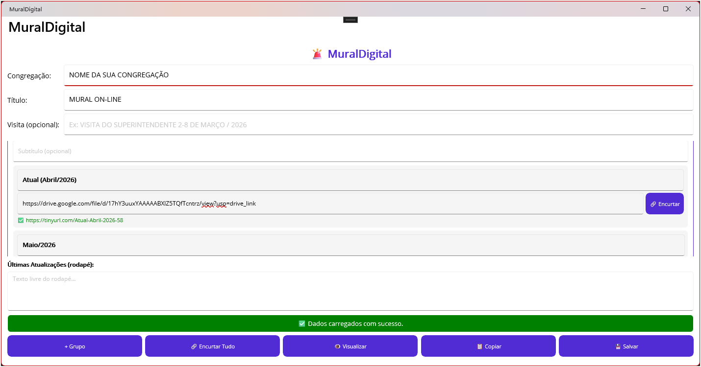 | 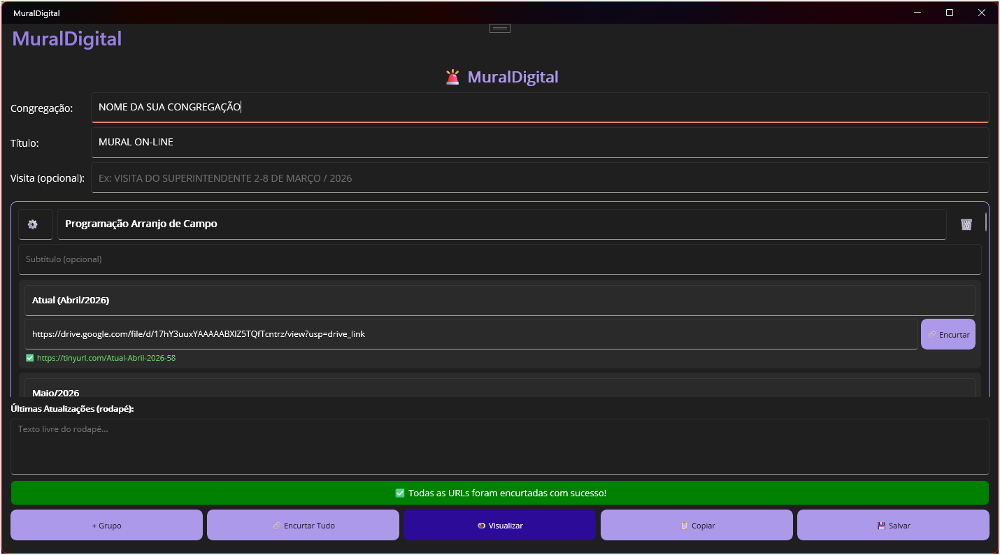 |
| Fundo branco, campos claros e botões roxos com contraste alto | Fundo grafite, campos escuros e o mesmo roxo ganhando mais destaque visual |

> 💡 O tema muda automaticamente ao trocar nas **Configurações do Windows → Personalização → Cores**.

### Pré-visualização e Envio

| ☀️ Tema Claro | 🌙 Tema Escuro |
| :---: | :---: |
| 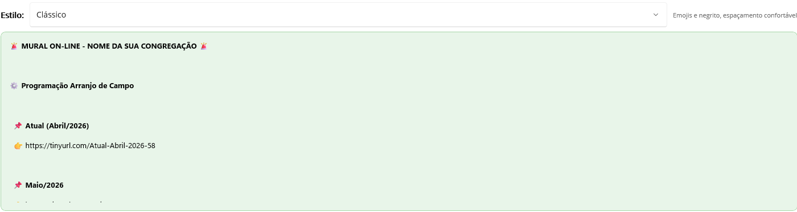 | 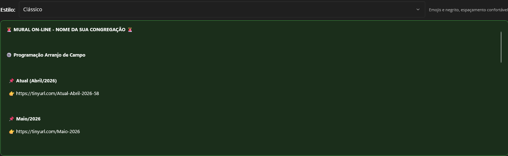 |
| Fundo geral claro, painel do mural em verde suave e área de contatos com campos brancos | Fundo geral escuro, painel do mural em verde profundo e área de contatos com campos escuros |

### 🗂 Galeria Complementar em Curadoria

Para manter o README principal objetivo e confiável, estes arquivos ficam reservados para cenários específicos (tutorial detalhado, troubleshooting ou release notes):

| Arquivo | Situação editorial | Uso recomendado |
| :--- | :--- | :--- |
| `03-grupo-expandido-light.png` | Em curadoria | Fluxo detalhado de edição de grupo |
| `04-grupo-expandido-dark.png` | Em curadoria | Contraste da edição no tema escuro |
| `05-encurtando-urls.png` | Em curadoria | Etapa de processamento de links |
| `13-status-erro.png` | Em curadoria | Exemplo de erro e recuperação |
| `14-whatsapp-resultado.png` | Em curadoria | Resultado final em cenário alternativo |
| `15-url-antes-depois.png` | Em curadoria | Comparação isolada de URL |

> Critério editorial: no README principal entram primeiro capturas completas e comparações visuais reais.

---

## 📖 Como Usar o App

### 1. Tela Principal 🏠

Ao abrir o app, seus dados salvos são carregados automaticamente (ou um mural padrão é criado na primeira execução).


**Campos do cabeçalho:**

| Campo | Para que serve | Exemplo |
| :--- | :--- | :--- |
| **Congregação** | Nome da congregação | `Cong. Auxiliadora` |
| **Título** | Título do mural | `MURAL ON-LINE` |
| **Visita** _(opcional)_ | Nota especial no topo do mural | `VISITA DO SUPERINTENDENTE 2-8 DE MARÇO / 2026` |

**Barra de ações (rodapé):**

| Botão | O que faz |
| :---: | :--- |
| `+ Grupo` | Adiciona um novo grupo ao mural |
| `🔗 Encurtar Tudo` | Encurta **todas** as URLs de uma vez |
| `👁 Visualizar` | Abre a tela de pré-visualização |
| `📋 Copiar` | Gera texto (estilo Clássico) e copia |
| `💾 Salvar` | Salva todos os dados no disco |

**Leitura visual das cores:**

- Botões lilás indicam ações secundárias ou operacionais do fluxo.
- O botão `Visualizar` aparece em roxo mais intenso para destacar a principal ação antes do envio.
- A barra verde de status confirma operações concluídas com sucesso e chama atenção sem competir com o conteúdo principal.
- No tema escuro, os mesmos botões ficam visualmente mais fortes porque o fundo grafite aumenta o contraste geral.

---

### 2. Preenchendo Grupos e Itens 📝

Cada **Grupo** representa uma seção do mural (ex: "Programação", "Arranjo de Campo"):

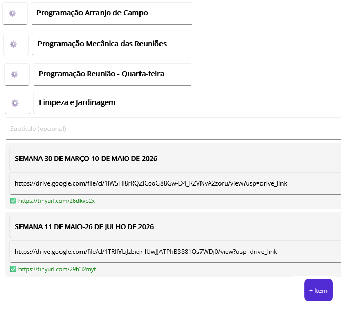

| Elemento | Detalhe |
| :--- | :--- |
| **Emoji** | Ícone do grupo (editável — clique e troque!) |
| **Título** | Nome do grupo (ex: `Programação Arranjo de Campo`) |
| **Subtítulo** | Informação extra, aparece em _itálico_ no mural |
| **Itens** | Cada item tem um **Label** + **URL do Google Drive** |

**Destaque do fluxo de itens por grupo:**

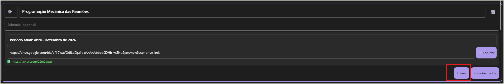

- O botão `+ Item` adiciona uma nova linha de item no grupo atual.
- O botão `🔗 Encurtar` atua no item individual.
- O botão `🔗 Encurtar Todos` acelera o processamento dos itens do grupo.

> 💡 **Dica**: use o botão `+ Item` em cada grupo para expandir rapidamente a programação. O botão `🗑️` remove o grupo inteiro.

---

### 3. A Mágica: Encurtando URLs 🔗

Este é o coração do app. Aquele link monstruoso do Google Drive...

```text
❌ ANTES:
https://drive.google.com/file/d/1aBcDeFgHiJkLmNoPqRsTuVwXyZ_0123456789ABCDEF/view?usp=sharing
```

...vira algo bonito e descritivo:

```text
✅ DEPOIS:
https://tinyurl.com/Atual-Abril-2026
```

**Duas formas de encurtar:**

| Método | Como |
| :--- | :--- |
| **Individual** | Botão `🔗 Encurtar` ao lado de cada item |
| **Em massa** | Botão `🔗 Encurtar Tudo` na barra de ações |

**O alias é gerado automaticamente a partir do label:**

| Label digitado | URL gerada |
| :--- | :--- |
| `Atual (Abril/2026)` | `tinyurl.com/Atual-Abril-2026` |
| `Semana 1` | `tinyurl.com/Semana-1` |
| `Arranjo de Campo` | `tinyurl.com/Arranjo-de-Campo` |

**Estratégia de fallback (nunca perde o link):**

```text
1º → TinyURL com alias descritivo
2º → TinyURL com alias + sufixo numérico (se alias já existir)
3º → TinyURL aleatório
4º → is.gd com slug descritivo
5º → is.gd aleatório
6º → URL original (último recurso — sempre funciona)
```

> 🛡️ O app **nunca** perde seu link. Se todos os serviços falharem, a URL original é mantida.

---

### 4. Visualizando o Mural

Ao clicar em `👁 Visualizar`, o app:

1. Re-encurta automaticamente URLs que foram alteradas
2. Abre a **tela de preview** com formatação fiel ao WhatsApp
3. Apresenta links coloridos, negrito real e itálico

| ☀️ Preview Claro | 🌙 Preview Escuro |
| :---: | :---: |
|  |  |

O texto renderizado simula **exatamente** como ficará no WhatsApp:

- `*texto*` → **texto** (negrito)
- `_texto_` → _texto_ (itálico)
- Links aparecem sublinhados e coloridos (azul no claro, verde-água no escuro)
- No tema claro, a hierarquia aparece com mais leveza visual; no escuro, o contraste entre painel, campos e botões fica bem mais marcado.

Na prática, a mudança de tema afeta principalmente:

- Fundo geral da janela e dos campos.
- Contraste do painel verde da prévia.
- Leitura dos contornos e separadores.
- Percepção de destaque dos botões roxos e da barra verde de confirmação.

---

### 5. Escolhendo o Estilo 🎨

No topo da tela de preview, o **seletor de estilo** permite trocar em tempo real:

| Estilo | O que privilegia |
| :---: | :--- |
| **Clássico** | Legibilidade, espaçamento confortável e leitura natural |
| **Compacto** | Economia de espaço e mensagem mais curta |
| **Destaque** | Maior impacto visual com bordas e ênfase decorativa |
| **Formal** | Estrutura numerada e aparência mais sóbria |

> Veja mais sobre cada estilo na seção [Os 4 Estilos de Formatação](#-os-4-estilos-de-formatação).

---

### 6. Enviando via WhatsApp 📱

Na tela de preview:

1. **Selecione** os contatos desejados (checkboxes)
2. Clique em **`✅ Enviar via WhatsApp`**
3. O texto é copiado automaticamente
4. O WhatsApp é aberto para **cada contato** selecionado
5. Cole com **`Ctrl+V`** e envie!


> ✅ Esta imagem destaca especificamente a ação de envio.
> 👥 A visualização e inclusão de contatos fica detalhada na seção **Gerenciamento de Contatos**.
> ⚠️ O envio é feito via **clipboard** (área de transferência) para preservar emojis e formatação rica. O WhatsApp não aceita texto formatado via API direta.

**Resultado final no WhatsApp:**

> 🎉 Bonito, organizado e profissional. Sem links enormes, sem formatação quebrada.

---

## 🎨 Os 4 Estilos de Formatação

O MuralDigital oferece **4 estilos** para agradar todos os gostos. Escolha o que mais combina com seu público:

### 1️⃣ Clássico — _"O confiável"_

O estilo padrão. Emojis amigáveis, espaçamento confortável e fácil de ler.

```text
🚨 *MURAL ON-LINE - Cong. Auxiliadora* 🚨

📌 *VISITA DO SUPERINTENDENTE 2-8 DE MARÇO / 2026*

📋 *Programação Arranjo de Campo*

  📌 *Atual (Abril/2026)*
  👉 https://tinyurl.com/Atual-Abril-2026

  📌 *Semana 1*
  👉 https://tinyurl.com/Semana-1
```

---

### 2️⃣ Compacto — _"Direto ao ponto"_

Para quem prefere economia de espaço. Tudo em menos linhas, sem perder a clareza.

```text
*🚨 MURAL ON-LINE — Cong. Auxiliadora*
📌 _VISITA DO SUPERINTENDENTE 2-8 DE MARÇO / 2026_

*📋 Programação Arranjo de Campo*
• *Atual (Abril/2026):* https://tinyurl.com/Atual-Abril-2026
• *Semana 1:* https://tinyurl.com/Semana-1
```

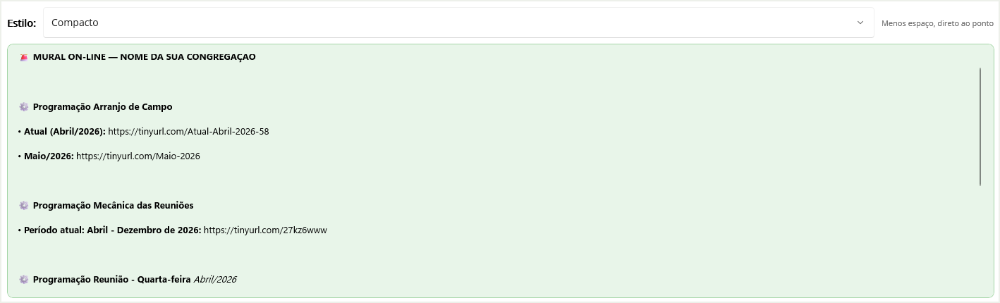

---

### 3️⃣ Destaque — _"O chamativo"_

Bordas decorativas e emojis brilhantes. Impossível não notar.

```text
╔══════════════════════════╗
  🚨 *MURAL ON-LINE* 🚨
  *Cong. Auxiliadora*
╚══════════════════════════╝

🔔 *VISITA DO SUPERINTENDENTE 2-8 DE MARÇO / 2026* 🔔

▬▬▬▬▬▬▬▬▬▬▬▬▬▬▬▬▬▬▬
✨ *📋 Programação Arranjo de Campo* ✨

  🔹 *Atual (Abril/2026)*
     🔗 https://tinyurl.com/Atual-Abril-2026

  🔹 *Semana 1*
     🔗 https://tinyurl.com/Semana-1
```

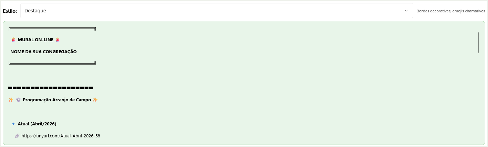

---

### 4️⃣ Formal — _"O elegante"_

Sem firulas. Numerado, limpo e com cara de documento oficial.

```text
*MURAL ON-LINE*
_Cong. Auxiliadora_

Aviso: *VISITA DO SUPERINTENDENTE 2-8 DE MARÇO / 2026*

*1. Programação Arranjo de Campo*
   1.1. Atual (Abril/2026)
         https://tinyurl.com/Atual-Abril-2026
   1.2. Semana 1
         https://tinyurl.com/Semana-1
```

  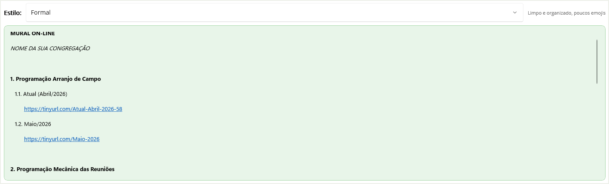

---

### Comparação Rápida

| | Clássico | Compacto | Destaque | Formal |
| :--- | :---: | :---: | :---: | :---: |
| **Emojis** | ✅ Moderado | ✅ Poucos | ✅ Muitos | ⚪ Mínimo |
| **Espaçamento** | Confortável | Reduzido | Amplo | Médio |
| **Bordas decorativas** | ❌ | ❌ | ✅ | ❌ |
| **Numeração** | ❌ | ❌ | ❌ | ✅ |
| **Tom** | Amigável | Prático | Festivo | Profissional |
| **Ideal para** | Dia a dia | Mensagens rápidas | Eventos especiais | Comunicados |

---

## 👥 Gerenciamento de Contatos

A tela de preview inclui um gerenciador completo de contatos WhatsApp:

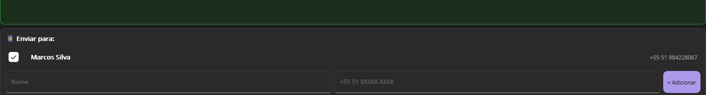

| Ação | Como fazer |
| :--- | :--- |
| **Selecionar** | Marque o checkbox ao lado do nome |
| **Adicionar** | Preencha nome + telefone e clique `+ Adicionar` |
| **Remover** | Botão `✕` (apenas contatos adicionados manualmente) |

**Contato padrão** (exemplo — não removível):

- 👤 Marcos Silva — (51) 98422-8067

> 📁 Os contatos são salvos no mesmo arquivo JSON do mural e carregados automaticamente.

---

## 📊 Feedback Visual Inteligente

O app mantém você informado com uma **barra de status colorida** na parte inferior:

| Estado | Cor | Exemplo |
| :--- | :---: | :--- |
| ⏳ Processando | 🟣 Roxo | `⏳ Encurtando URLs... (3/7)` |
| ✅ Sucesso | 🟢 Verde | `✅ Dados carregados com sucesso.` |
| ⚠️ Aviso | 🟠 Laranja | `⚠️ Selecione pelo menos um contato.` |
| ❌ Erro | 🔴 Vermelho | `❌ Erro ao carregar dados.` |

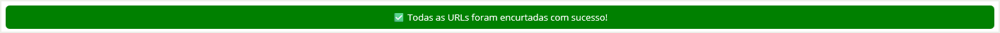

> A barra some automaticamente quando não há mensagem ativa.

---

## 🛠 Tecnologias

| Componente | Tecnologia |
| :--- | :--- |
| Framework | **.NET 9** + **.NET MAUI** |
| Padrão MVVM | **CommunityToolkit.Mvvm 8.4.2** |
| Serialização | **System.Text.Json** |
| Encurtador primário | **TinyURL API** (alias descritivo) |
| Encurtador fallback | **is.gd** |
| Plataforma alvo | **Windows 10/11** (self-contained) |
| Publicação | Script PowerShell + 7-Zip |

---

## 🏗 Arquitetura

O projeto segue o padrão **MVVM** (Model-View-ViewModel):

```text
MuralDigital/
├── 📄 Models/           ← Entidades de dados
│   ├── MuralConfig          Configuração completa do mural
│   ├── MuralGroup           Grupo (ex: "Arranjo de Campo")
│   ├── MuralItem            Item com label + URLs
│   └── WhatsAppContact      Contato WhatsApp (nome + fone)
│
├── 🧠 ViewModels/       ← Lógica de apresentação
│   ├── MainViewModel        VM da tela principal
│   ├── PreviewViewModel     VM do preview + envio
│   ├── MuralGroupViewModel  VM de grupo (encurtar, add item)
│   ├── MuralItemViewModel   VM de item (dirty tracking)
│   └── ContactViewModel     VM de contato
│
├── 🖥️ Views (*.xaml)    ← Páginas da interface
│   ├── MainPage             Editor do mural
│   └── PreviewPage          Preview + envio WhatsApp
│
├── ⚙️ Services/         ← Regras de negócio
│   ├── MuralDataService     Persistência JSON local
│   ├── UrlShortenerService  TinyURL + is.gd (5 estratégias)
│   └── WhatsAppTextGenerator   4 geradores de estilo
│
├── 🔄 Converters/       ← Conversores XAML
│   └── Converters.cs        WhatsAppFormattedText, InvertBool, etc.
│
└── 📦 Scripts/          ← Automação
    └── Publish.ps1          Publicação self-contained + 7z
```

### Fluxo de dados

```text
┌──────────┐    ┌───────────┐    ┌──────────────────┐    ┌───────────┐
│  Usuário │───▶│ MainPage  │───▶│ UrlShortener     │───▶│ TinyURL   │
│          │    │ (XAML)    │    │ Service           │    │ / is.gd   │
└──────────┘    └─────┬─────┘    └──────────────────┘    └───────────┘
                      │
                      ▼
                ┌───────────┐    ┌──────────────────┐    ┌───────────┐
                │ Preview   │───▶│ WhatsAppText     │───▶│ WhatsApp  │
                │ Page      │    │ Generator         │    │ (Ctrl+V)  │
                └───────────┘    └──────────────────┘    └───────────┘
                      │
                      ▼
                ┌───────────┐
                │ JSON File │  ← Persistência local
                └───────────┘
```

---

## 🚀 Publicação e Execução

### ▶️ Executando (sem instalar nada)

1. Extraia o arquivo `.7z` da pasta `VersaoAtual/`
2. Execute **`MuralDigital.exe`**
3. Pronto! **Não requer** .NET Runtime instalado — tudo está incluso

### 🔨 Gerando nova publicação

```powershell
.\Scripts\Publish.ps1
```

O script automatiza todo o processo:

| Etapa | O que faz |
| :---: | :--- |
| 1 | Limpa publicação anterior |
| 2 | Restaura pacotes NuGet |
| 3 | Publica em modo **self-contained** para Windows x64 |
| 4 | Comprime o resultado em `.7z` |
| 5 | Copia para `VersaoAtual/` |

Veja mais detalhes em [`Scripts/Publish.ps1`](Scripts/Publish.ps1).

---

## 📁 Estrutura do Projeto

```text
MuralDigital/
│
├── App.xaml / App.xaml.cs           # Entry point, recursos globais
├── AppShell.xaml                    # Navegação Shell (rota "preview")
├── MauiProgram.cs                   # DI container, registro de serviços
│
├── MainPage.xaml / .cs              # Tela principal (editor do mural)
├── PreviewPage.xaml / .cs           # Tela de preview + envio WhatsApp
│
├── Models/                          # Entidades de dados
├── ViewModels/                      # Lógica de apresentação (MVVM)
├── Services/                        # Serviços de negócio
├── Converters/                      # Conversores XAML
├── Scripts/                         # Automação (Publish.ps1)
├── VersaoAtual/                     # Build mais recente (.7z)
├── Docs/Imagens/                    # Screenshots do app
│
├── Resources/
│   ├── AppIcon/                     # Ícone do app
│   ├── Fonts/                       # OpenSans
│   ├── Splash/                      # Splash screen
│   └── Styles/                      # Colors.xaml, Styles.xaml
│
└── Platforms/                       # Código específico por plataforma
    └── Windows/                     # Alvo principal
```

---

## 💾 Dados Persistidos

Os dados são salvos automaticamente em JSON:

```text
%LOCALAPPDATA%\Packages\<AppId>\LocalState\Data\mural_config.json
```

**O arquivo armazena:**

| Dado | Descrição |
| :--- | :--- |
| Cabeçalho | Congregação, título, nota de visita |
| Grupos | Emoji, título, subtítulo |
| Itens | Label, URL original, URL encurtada |
| Contatos | Nome, telefone, flag padrão/selecionado |
| Rodapé | Texto livre |

> 🔄 Os dados são carregados automaticamente ao abrir o app. Sem login, sem nuvem, sem complicação.

---

## 🎬 Resumo — Do Caos à Elegância

```text
╔═══════════════════════════════════════════════════════════════╗
║                                                               ║
║  😰 ANTES (sem o MuralDigital):                              ║
║                                                               ║
║  "Gente, segue os links:"                                    ║
║  https://drive.google.com/file/d/1aBcDeFgH.../view           ║
║  https://drive.google.com/file/d/2xYzAbCdE.../view           ║
║  https://drive.google.com/file/d/3mNoPqRsT.../view           ║
║                                                               ║
║  (ninguém lê, ninguém clica, ninguém liga)                   ║
║                                                               ║
╠═══════════════════════════════════════════════════════════════╣
║                                                               ║
║  😎 DEPOIS (com o MuralDigital):                              ║
║                                                               ║
║  🚨 *MURAL ON-LINE - Cong. Auxiliadora* 🚨                   ║
║                                                               ║
║  📋 *Programação Arranjo de Campo*                            ║
║                                                               ║
║    📌 *Atual (Abril/2026)*                                    ║
║    👉 tinyurl.com/Atual-Abril-2026                            ║
║                                                               ║
║    📌 *Semana 1*                                              ║
║    👉 tinyurl.com/Semana-1                                    ║
║                                                               ║
║  (bonito, organizado, todo mundo clica) ✨                    ║
║                                                               ║
╚═══════════════════════════════════════════════════════════════╝
```

---

**MuralDigital** — Porque ninguém merece colar links de 80 caracteres no WhatsApp. 🚀

Feito com ☕ e .NET MAUI por **Marcos Silva**
